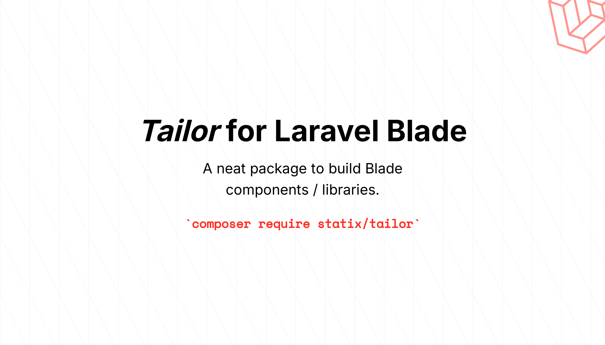

# _Tailor_ for Laravel Blade

[](https://packagist.org/packages/statix/tailor)
[](https://packagist.org/packages/statix/tailor)

A _neat_ package to help build Blade component libraries.

## Installation

```bash
composer require statix/tailor
```

## Configuration

Publishing the configuration file is optional.

```bash
php artisan vendor:publish --tag=tailor-config
```

## Usage

### Building a Component

```blade
// view/components/button/index.blade.php

@props([
    'variant' => 'primary',
    'size' => 'md'
    'type' => 'button',
    'tag' => 'button',
])

@php
// create the tailor
$c = Tailor::make('button');

// start setting up the attributes
$c->attributes()
    ->set([
        'data-variant' => $variant,
        'data-size' => $size,
    ])->if($tag !== 'button', function ($set) use ($type) {
        $set('type', $type);
        $set('aria-role', 'button');
    })->if($tag === 'a', function ($set) {
        $set('aria-role', 'link');
    });

// start building the variants
$c->variant('primary');
$c->variant('secondary');

// start building the classes common to all variants
$c->classes()
    ->base([
        'rounded-md',
        'border',
    ])->focus([
        'focus:ring-2',
        'focus-visible:outline-offset-2',
    ])->match($size, [
        'sm' => 'px-2 py-1',
        'md' => 'px-3 py-2',
        'lg' => 'px-4 py-3',
        'xl' => 'px-5 py-4',
        'default' => $size,
    ]);

// start building the classes for the primary variant
$c->variant('primary')
    ->light([
        'bg-indigo-600',
    ])->hoverLight([
        'hover:bg-indigo-500',
    ])->focusLight([
        'focus-visible:outline-indigo-600',
    ])->dark([
        'dark:text-white',
        'dark:bg-indigo-700',
    ]);

// start building the classes for the secondary variant
$c->variant('secondary')
    ->light([
        'bg-gray-200',
    ])->hoverLight([
        'hover:bg-gray-300',
    ])->focusLight([
        'focus-visible:outline-gray-200',
    ])->dark([
        'dark:text-gray-200',
        'dark:bg-gray-700',
    ])->focusDark([
        'focus-visible:outline-gray-200',
    ]);

// merge the attributes and classes with the passed attributes
$c->attributes()->merge($attributes->getAttributes());
$c->classes()->merge($attributes->get('class', ''));

// set the variant to use
$c->setVariant($variant);

// now when we output the component, the classes
// and attributes will be applied, specific to the variant
@endphp

<{{ $tag }} {{ $c }}>{{ $slot}}<{{ $tag }}>
```

### Using the Component

```blade
<x-button variant="primary" size="md" type="button" class="my-2">
    Click Me
</x-button>

<x-button variant="secondary" size="px-6 py-2" tag="a" href="#">
    A link button
</x-button>
```

# Links

-   https://github.com/laravel/framework/blob/11.x/src/Illuminate/View/ComponentAttributeBag.php
-   https://github.com/laravel/framework/blob/11.x/src/Illuminate/View/Compilers/Concerns/CompilesComponents.php#L163
-   https://github.com/gehrisandro/tailwind-merge-php
